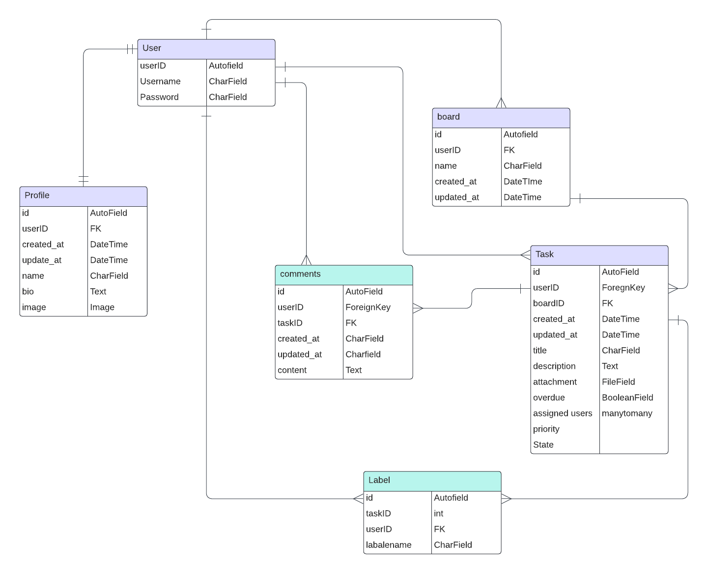
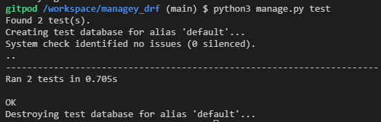
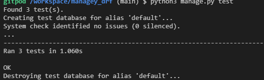
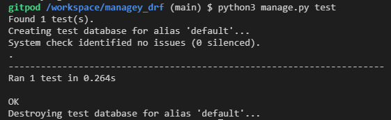
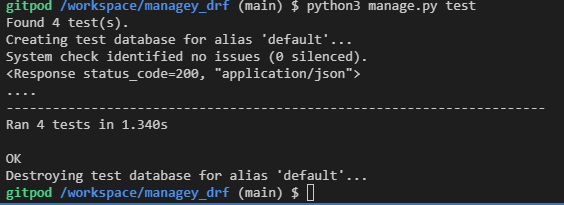
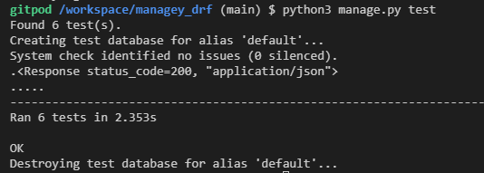
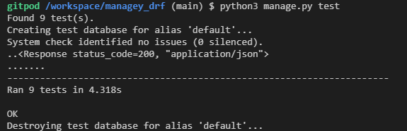
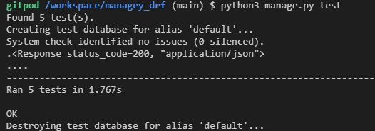
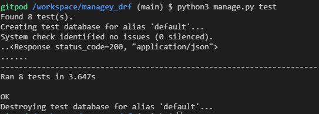

This is the backend REST API repository whic is used for my frontend project 

View Live site: 

View API site: 

View Frontend README.md file: 
 
View Backend README.md file: 

# Table of Contents
## [User story](user-story)
## [Entity Relationship Diagram](ERD)
## [Models](Models)
## [Testing](Tests)
## [Technologies Used](Tech-stack)
## [Deployment to Heroku](Deployment)
## [Credits](Credits)
    - Content
    - Media
## [Acknowledgement](Acknowledgements)

# [User story](user-story)

# [Entity Relationship Diagram](ERD)

The following image represents the database model structure of the web application 

## [Logic Flow Diagram](Logic-chart)

The following image represents the logic flow of the web application 

# [Models](Models)
## User 
- The user model is part of the django alluth library
- The user model contains all the information of the user
- Has a one to one relationship with the owner field in the profile model
- Has a one to many relatiionship with the Task model
- Has a one to many relatiionship with the Comments model 
## Profile
- The profile model has a one to one relationship with the user, this is refrenced by the userID field within the profile. 
- The model contains the following fields: created_at, updated_at, name, bio, image, owner, is_owner
## Task
- The task model has a one to many relationship with the user. It refrences the UserID
- The model contains the following fields: owner, created_at, updated_at, title, description, attachment, overdue, assigned_users, priority, state
## Comments
- The comments model has a one to many relationship with user, it references the UserID
- It has a foreignkey relation with the task moel, it references the TaskID
- It has the follwowing fields: id, owner, created_at, updated_at, content taskID

# [Testing](Tests)
The following tests were carried out on the application:
1. Manual Tests
2. Automated tests

## Manual Tests
- As an admin, I would like to create, edit and delete users tasks and comments so I have control over the content in my application.

| **Test** | **Action** | **Expected Result** | **Actual Result** |
|----------|------------|---------------------|-------------------|
| User | Create, update, delete user | a user can be created, updated and deleted | works as expected |
| Profile | Create, update, delete profile | a user profile can be created, updated and deleted | works as expected |
| Task | Create, update, delete task | a task can be created, updated and deleted | works as expected |
| Comment | Create, update, delete comment | a user comment can be created, updated and deleted | works as expected |

## Automated tests
Automated tests were conduted using Django Rest Framework APITestCase
- Summary

  
Task test report

  
  
  
  
  
  
  
  
  

# [Technologies Used](Tech-stack)
## Languages
- [Python]()
## Libraries and Frameworks
- [Django]()
- [Django REST Framework]()
## Packages
- [cloudinary]()
- [rest_framework]()
- [Pillow]()
- [cloudinary_storage]()
- [django-filter]()
## Other tools
- [GitHub]()
- [Gitpod]()
- [Heroku]()
- [Cloudinary]()
- [GitBash]()
- [asgiref]()
- [ElephantSQL]()