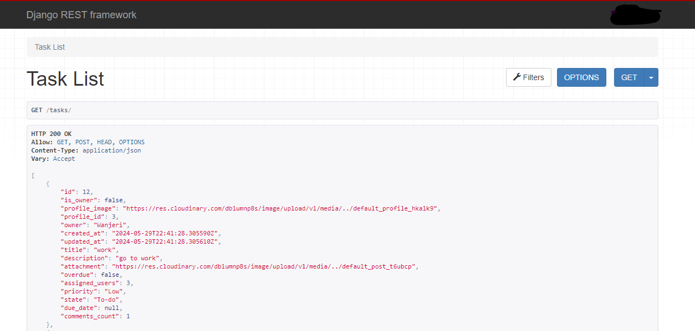
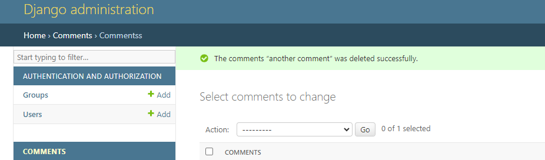
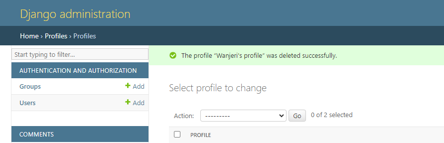
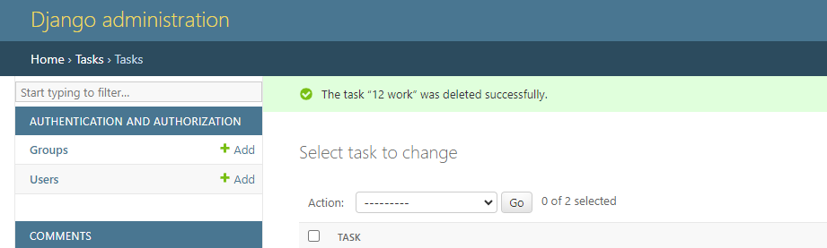
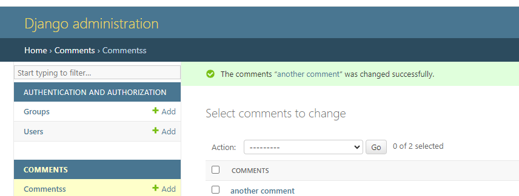
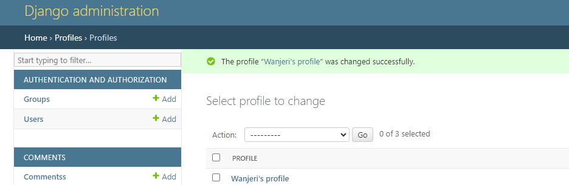
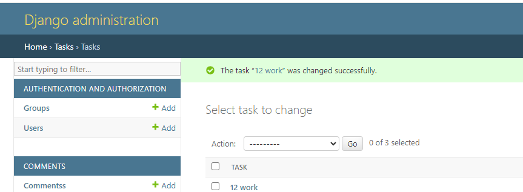
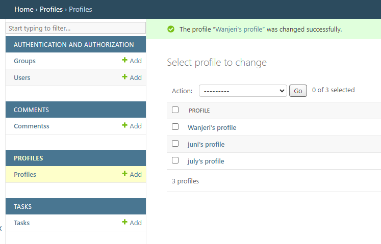
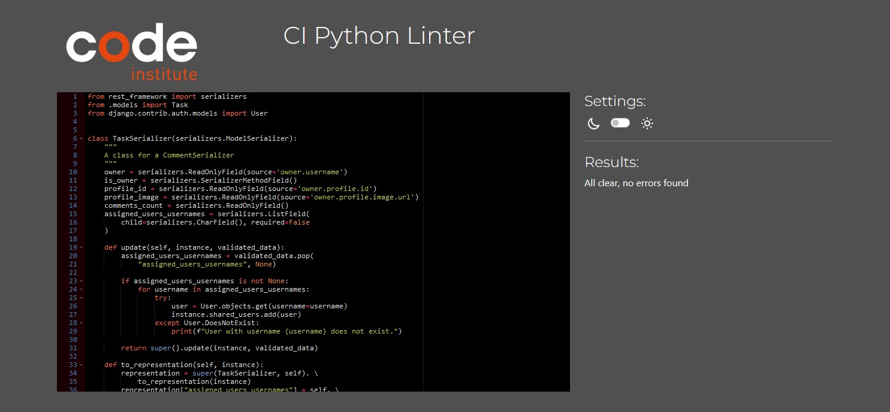

This is the backend REST API repository whic is used for my frontend project []()

View Live site: [here](https://managey-a1b31600d931.herokuapp.com/)

View Frontend  [here](https://github.com/Njorogetracy/managey)
 
# Table of Contents
## [User story](#user-story)
## [Entity Relationship Diagram](#Entity-Relationship-Diagram)
## [Models](#Models)
## [Testing](#Tests)
## [Technologies Used](#Tech-stack)
## [Deployment to Heroku](#Deployment-to-Heroku)
## [Credits](#Credits)
    - Content
    - Media
## [Acknowledgement](#Acknowledgement)


# User story

# Entity Relationship Diagram
<details>
<summary>The following image represents the database model structure of the web application </summary>

</details>

## Logic Flow Diagram
<details>
<summary>The following image represents the logic flow of the web application </summary>

</details>

# Models
## User 
- The user model is part of the django alluth library
- The user model contains all the information of the user
- Has a one to one relationship with the owner field in the profile model
- Has a one to many relatiionship with the Task model
- Has a one to many relatiionship with the Comments model 
## Profile
- The profile model has a one to one relationship with the user, this is refrenced by the userID field within the profile. 
- The model contains the following fields: created_at, updated_at, name, bio, image, owner, is_owner
## Task
- The task model has a one to many relationship with the user. It refrences the UserID
- The model contains the following fields: owner, created_at, updated_at, title, description, attachment, overdue, assigned_users, priority, state
## Comments
- The comments model has a one to many relationship with user, it references the UserID
- It has a foreignkey relation with the task moel, it references the TaskID
- It has the follwowing fields: id, owner, created_at, updated_at, content taskID

# Testing
The following tests were carried out on the application:
1. Manual Tests
2. Automated tests

## Manual Tests
- As an admin, I would like to create, edit and delete users tasks and comments so I have control over the content in my application.

| **Test** | **Action** | **Expected Result** | **Actual Result** |
|----------|------------|---------------------|-------------------|
| User | Create, update, delete user | a user can be created, updated and deleted | works as expected |
| Profile | Create, update, delete profile | a user profile can be created, updated and deleted | works as expected |
| Task | Create, update, delete task | a task can be created, updated and deleted | works as expected |
| Comment | Create, update, delete comment | a user comment can be created, updated and deleted | works as expected |


## Automated tests
Automated tests were conduted using Django Rest Framework APITestCase
- Summary
<details>
  <summary>Task test report</summary>
  
  
  
  
  
  
  
  
  
</details>

## Admin tests
Tests were conduted on the Admin panel
- Summary
<details>
  <summary>Task test report</summary>
  
  
  
  
  
  
  
  
  
  
</details>

#  PEP 8 Validation
<details>
<summary>No errors were found</summary>

</details>

# Technologies Used
## Languages
- [Python]()
## Libraries and Frameworks
- [Django]()
- [Django REST Framework]()
## Packages
- [cloudinary]()
- [rest_framework]()
- [Pillow]()
- [cloudinary_storage]()
- [django-filter]()
## Other tools
- [GitHub]()
- [Gitpod]()
- [Heroku]()
- [Cloudinary]()
- [GitBash]()
- [asgiref]()
- [ElephantSQL]()

# Deployment to Heroku
- This project was deployed to Heroku
- The deployment process:
### Project setup
- Create a new repository on Github
- Open the created repository on Gitpod
- Install Django and other dependecies:
  - Install Django: **pip install 'django'**
  - Create a new projects: django-admin startproject managey_drf
  - Install cloudinary(after setting up a  cloudinary account): **pip install django-cloudinary-storage**
  - Install Pillow: **pip install Pillow**
- Add the installed apps to the **Settings.py** file
- Create an env.py file in the root directory and add your API key
- Import the **env.py** file into your **Settings.py** and remember to reference the new Cloudinary URL as well
- In the **Settings.py** define the Media_url and Default_storage_file
- Create the applications using the command: **python3 manage.py startapp <app-name>**
- Add the created applocations to the **Setting.py**
- Add the **requirements.txt** and update all the dependecies

### Preparation for deployment
- Install JSON Web Token Application : **pip install dj-rest-auth**
- Add both Frameworks **rest_framework. authtoken and dj_rest_auth** to the INSTALLED_APPS in **settings.py**
- Add the url path in the main app **urls.py** file
- Migrate the database : **python manage.py migrate**
- Install Django All Auth: pip install **'dj-rest-auth[with_social]'** and add the app to the **setings.py**
- Add SITE_ID = 1 in settings.py
- Add the registration url path to the main urls.py file
- To add the JWT functionality, type **pip install djangorestframework-simplejwt** in the terminal 
- Add **```os.environ['DEV'] = '1'```** to the **env.py** file, and **```DEBUG = 'DEV' in os.environ```** to the **settings.py** file
- In the settings.py file, add the following code snipet in order to differentiate between the development and production environments, and set the pagination and datetime format:
```Python
REST_PAGINATION = "rest_framework.pagination.PageNumberPagination"

REST_FRAMEWORK = {
    "DEFAULT_AUTHENTICATION_CLASSES": [
        (
            "rest_framework.authentication.SessionAuthentication"
            if "DEV" in os.environ
            else "dj_rest_auth.jwt_auth.JWTCookieAuthentication"
        )
    ],
    'DEFAULT_PAGINATION_CLASS':
        'rest_framework.pagination.PageNumberPagination',
    'PAGE_SIZE': 10,
    'DATETIME_FORMAT': '%d %b %Y'
} 
```
- To enable authentication of the JWT, cookie declaration and to ensure the tokens are sent over HTTPS add the followinf in the **settings.py** :
```Python
REST_USE_JWT = True
JWT_AUTH_SECURE = True
JWT_AUTH_COOKIE = "my-app-auth"
JWT_AUTH_REFRESH_COOKIE = "my-refresh-token"
JWT_AUTH_SAMESITE = "None"
```
- Create a new route, which will act as a welcome screen to anyone visiting the root route of the API
- In the main app views.py, add the code below: 
```Python
from rest_framework.decorators import api_view
from rest_framework.response import Response


@api_view()
def root_route(request):
    """
    Function to return a welcome message
    upon loading the API
    """
    return Response({"message": "Welcome to the League Hub DRF API!"})
```

Add that new route to the urlpatterns list in the main **urls.py** file

```Python
from .views import root_route

    path("", root_route),
```
- Create a new production database for with ElephantSQL
  - Log into [ElephantSQL](https://www.elephantsql.com/)
  - Click **Create New Instance**
  - Give your plan a name
  - Select \*_Tiny Turtle (Free)_ plan
  - Click **Select Region** and pick a data center near you
  - Click **Review**, double check the information you provided, once happy, click **Create Instance**
- Get the databse url from your dashboard
- Back in your local projects, add the url in the **env.py**. Make sure to store it in a variable which can be referenced without exposing the value to others:
```Python
os.environ.setdefault(
    "DATABASE_URL", "YOUR DB URL HERE",
)
```
- In the terminal type: **pip install dj_database_url** to install your database
- Import it into the main **settings.py** file

```Python
import dj_database_url
```
- We can seperate the development and production environment databases with the following code: 
```Python
if "DEV" in os.environ:
    DATABASES = {
        "default": {
            "ENGINE": "django.db.backends.sqlite3",
            "NAME": BASE_DIR / "db.sqlite3",
        }
    }
else:
    DATABASES = {"default": dj_database_url.parse(
        os.environ.get("DATABASE_URL"))}
    print("Connected to live database")
```

- Next we will install gunicorn. In the terminal, type in the following: **pip install gunicorn**

- Now create a Procfile at the root level in your project

- Within that newly created Procfile, add the following code to let Heroku know how to run the project:
```Python
release: python manage.py makemigrations && python manage.py migrate
web: gunicorn managey_drf.wsgi
```
- In **settings.py**, we need to tell the project which hosts to allow
```Python
ALLOWED_HOSTS = [
    os.environ.get("ALLOWED_HOST"),
    "127.0.0.1",
]
```
- It's time to install **CORS**
- In the terminal, type in **pip install django-cors-headers** and then add it to the INSTALLED_APPS
- Add it to the MIDDLEWARE list, its important that it is placed at the top of the list:
```Python
MIDDLEWARE = [
    "corsheaders.middleware.CorsMiddleware",
]
```
- We need to set the ALLOWED_ORIGINS for the network requests made to the server. In **settings.py** file, add the below:
```Python
if "CLIENT_ORIGIN" in os.environ:
    CORS_ALLOWED_ORIGINS = [
        os.environ.get("CLIENT_ORIGIN"),
    ]
if "CLIENT_ORIGIN_DEV" in os.environ:
    CORS_ALLOWED_ORIGINS.append(os.environ.get("CLIENT_ORIGIN_DEV"))

CORS_ALLOW_CREDENTIALS = True

JWT_AUTH_SAMESITE = 'None'
```
- Replace the SECRET_KEY variable in **settings.py** to reference the secret key that we will create in **env.py**
- In **env.py** create a new variable called SECRET_KEY and give it a value:
```Python
os.environ.setdefault("SECRET_KEY", "YOUR SECRET KEY HERE")
```
- Back in **settings.py**, change the SECRET_KEY value to point to the SECRET_KEY you just created in **env.py**:
```Python
SECRET_KEY = os.getenv("SECRET_KEY")
```
- Update the requirements.txt file: **pip freeze > requirements.txt**
- Add and commit the changes
### Deployment
This project was deployed to Heroku.
- Use **pip freeze > requirements.txt** to save libraries that need to be installed in the file
- Cloudinary is used to host the images post, it's important to have a cloudinary account
- Create an account or login if you have one
- Navigate to the Dashboard, copy and store the value of the API Environment Variable, this will be used in the Heroku Config Vars
- The database will be hosted on **ElephantSQL**
- Login to ELephantSQL or create an account if you don't have one
- Create a new instance
- Set up plan, choose a name, and select *Tiny Turtle(free)* plan. Leave the tags option blank
- Select region, choose the data center nearest to your location
- Click review, if satisfied with the deatils presented and click create instance button. 
- On the dashboard, click the newly created instance and get the ElephantSQL database url. It will be used in the Heroku Config Vars
- Login in to Heroku and login/create new account
- Create a new app by clicking *new* button, then selecting *create new app* option
- Choose app name, prefferably the name of the project, select a region and create app
- Go to settings, reveal the config vars and add required variables; names and values:
    - CLOUDINARY_URL:
    - DATABASE_URL:
    - DISABLE_STATIC:
    - SECRET_KEY:
- Go to deploy tab, choose GitHub as a deployment method and search for the name of your repository
- Connect to the repository, select the branch you would like to build the app from
- Manually deploy project or setup automatic deploys(automatically deploys your app with every new change)
- After the app build is complete, click open app, this will redirect you to the deployed link

## Forking the Github Repository
You can make a copy of the original repository on GitHub. 
Forking can be done as follows:
- Navigate to Github.com and login 
- Once logged in, go to the repository you'd wish to fork
- At the top right corner of the page, click the fork icon
- This created a copy of the original project
**note if you are not a member of an organisation on GitHub then you will not be able to fork your own repository**

## Cloning the Github Repository
Clonning can be done as follows:
- Navigate to Github.com and login 
- Once logged in, go to the repository you'd wish to clone
- Select the preferred clone method from HTTPS. SSH or GitHub CLI
- Above the list of files(top right of screen), click Code button
- Copy the URL using HTTPS, under "HTTPS"
- Type ```git clone``` in your terminal, and then paste the URL you copied
- Press Enter to create your local clone.

[Back to Top](#Table-of-Contents)